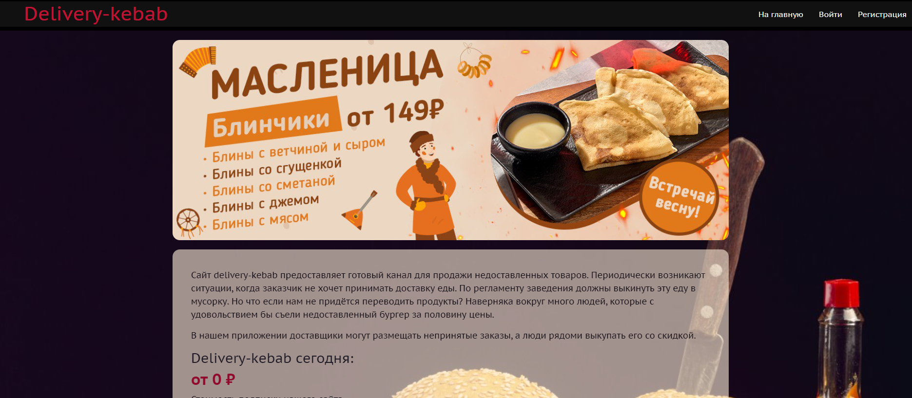
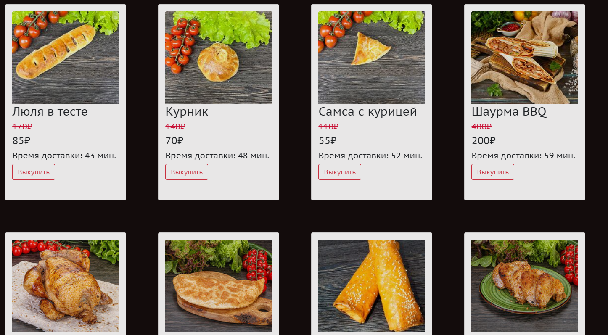
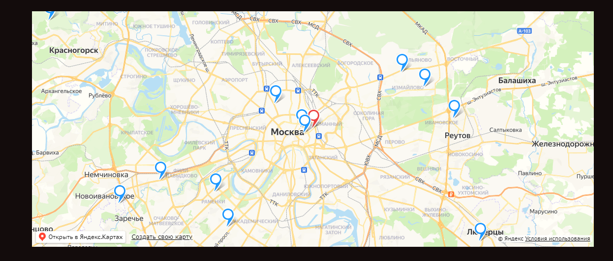

# delivery-kebab

Сайт delivery-kebab предоставляет готовый канал для продажи
недоставленных товаров. Периодически возникают ситуации, когда заказчик
не хочет принимать доставку еды. По регламенту заведения должны выкинуть
эту еду в мусорку. Но что если нам не придётся переводить продукты?
Наверняка вокруг много людей, которые с удовольствием бы съели
недоставленный бургер за половину цены.

В нашем приложении доставщики могут размещать непринятые заказы, а люди рядоми выкупать его со скидкой.

# Шаг 1: Создание файла .env
Для подключения к базе данных и доступа к сервису Яндекс.Картам, создайте файл .env в корневой директории проекта. В этом файле вы должны указать следующие переменные:

1) название_вашей_базы_данных
2) имя_пользователя_базы_данных
3) пароль_пользователя_базы_данных
4) YANDEX_MAPS_API_KEY=ваш_api_ключ_от_Яндекс.Карт

Получить свой ключ вы можете зарегистрировавшись в кабинете разработчика на сайте Яндекса.

Образец файла .env вы можете найти в файле .env_example. Этот файл содержит примеры значений для каждой переменной. Переименуйте его в .env и заполните соответствующие значения.

# Шаг 2: Установка зависимостей
Перед запуском приложения убедитесь, что все зависимости установлены. Выполните следующую команду в корневой директории проекта:

`npm install`

Это загрузит все необходимые зависимости из npm.

# Шаг 3: Запуск приложения
Для запуска клиентского приложения введите следующую команду:

`npm run dev`

Эта команда запустит сервер разработки и откроет ваше приложение в браузере.

Следуйте этим инструкциям, чтобы успешно запустить клиентское приложение.

# Логика приложения
После успешного запуска клиентского приложения, вас будет встречать главная страница для незарегистрированного пользователя. Для того чтобы просматривать все товары и сделать заказ, необходимо зарегистрироваться.

*Рисунок 1*. Home page для неавторизованного пользователя

### Регистрация
При регистрации у вас будет возможность выбрать роль: продавца или покупателя. Давайте выберем роль покупателя и рассмотрим его возможности.

### Главная страница покупателя
После успешной регистрации и входа в систему вам станет доступна главная страница с товарами, отсортированными по расстоянию. Вы можете просматривать товары и добавлять их в свой заказ. **Обратите внимание, что вы сможете добавить товар в свой заказ только в том случае, если никто другой не успел это сделать.**

*Рисунок 2*. Home page для авторизованного пользователя

### Карта с метками товаров
На главной странице также присутствует карта с центром в вашем домашнем адресе и метками всех доступных товаров. Это позволяет вам наглядно видеть расположение товаров и легко ориентироваться.

*Рисунок 3*. Карта с метками товаров и покупателя

### Выкуп товара
Вы можете выкупить товар нажав на кнопку выкупить как и на странице так и напрямую на карте. При нажатии кнопки, курьеру придет информация с вашим именем, номером телефона и вашим местоположением.

### Поиск товаров
Покупателю доступна страница поиска, где предоставлена возможность использовать функцию поиска товаров по их названию. Это позволяет удобно находить интересующие вас товары без необходимости пролистывания всех предложений.

### Личный кабинет покупателя
Вы можете просмотреть свой заказ на своей личной странице. Если вы передумали покупать, есть возможность отменить заказ. Также на личной странице есть кнопка для изменения вашего адреса доставки.

*Рисунок 4*. Карта с метками товаров и покупателя

## Логика приложения для курьера
После успешной регистрации и выбора роли курьера, вам станет доступен личный кабинет с его функциональными возможностями.

### Добавление заказа
На главной странице курьера отсутствуют товары. Весь функционал для курьера доступен только в его личном кабинете. Здесь вы можете нажать кнопку "Добавить заказ", чтобы указать характеристики своего продукта и его местоположение. ***Обратите внимание, что в строке "Скидка" принимается значение от 0 до 100.***

### Мои товары и активные заказы
В личном кабинете отображаются все ваши добавленные товары, а также активные заказы, в которых вы являетесь курьером. В заказах содержится информация о пользователе, который сделал заказ.

*Рисунок 5*. Личный кабинет курьера

### Подтверждение доставки
Вы можете отметить товар как доставленный, таким образом, он перестанет отображаться в вашем списке активных заказов. Это поможет вам следить за выполненными заказами и организовать свою работу более эффективно.

### Просмотр маршрута
Вы можете просмотреть маршрут от вашего товара до заказчика, чтобы наглядно увидеть его на карте. Это поможет вам планировать свой маршрут доставки и оптимизировать вашу работу.

